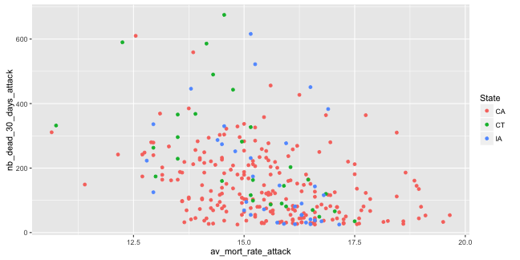

<style type="text/css">
body, td {
   font-size: 14px;
}
code.r{
  font-size: 17px;
}
pre {
  font-size: 20px
}
</style>

## Background
This slidedeck was created to give more information about my Hospital Performance Comparison Shiny App which can be found at the following URL:
[Hospitals Comparison By State App](https://laurecasanova.shinyapps.io/Hospitals_Comparison_By_State/ "Hospitals Performance Comparison By State")


The application is based on the [Hospital dataset](https://d396qusza40orc.cloudfront.net/rprog%2Fdata%2FProgAssignment3-data.zip "Click to download the Zipfile") which was brought to my attention during the [R Programming Course](https://www.coursera.org/learn/r-programming "R Programming") of [the Data Science Specialization](https://www.coursera.org/specializations/jhu-data-science "the Data Science Specialization") by Johns Hopkins University via Coursera.


--- .class #id 
## ui.R: Getting the inputs
The ui.R program is used to :

* Collect the different States the user is willing to compare
* Collect the first variable the users want to have more information on
* Collect the second variable the users want to have more information on

In the code chunk below I used for the default values of the app:


```r
input <- list()
input$State_sel <- c("CA","CT","IA")
input$Variable1 <- "av_mort_rate_attack"
input$Variable2 <- "nb_dead_30_days_attack"
```

--- .class #id 
## server.R: Preparing the outputs
There are two outputs for this app, a plot and a table. To create them, the dataset was subsetted to include only the selected States as well as both of the selected variables.


```r
load(file = "./data/Hospitals.rda")
hosp <- subset(Hospitals, State %in% input$State_sel, c(input$Variable1, input$Variable2, "State"))
```

The State variable is then transformed into a factor variable before the plot is prepared with the qplot function.


```r
 hosp$State <- as.factor(hosp$State)
    qplot(x=hosp[,1], y=hosp[,2], data=hosp,colour=State, xlab=input$Variable1, ylab=input$Variable2)
```

For the plot, both means are computed before the table is printed.

```r
m1 <- aggregate(hosp[,1], by=list(hosp$State), mean)
    m2 <- aggregate(hosp[,2], by=list(hosp$State), mean)
    print(setNames(cbind(m1, m2[,2]), c("State",input$Variable1, input$Variable2)))
```

--- .class #id 
## ui.R: Displaying the outputs



```
##   State av_mort_rate_attack nb_dead_30_days_attack
## 1    CA            15.53200               142.6489
## 2    CT            14.88621               243.7586
## 3    IA            15.52714               176.6571
```


